Simple Buffer Overflow Exploit on x86_64
-----
I have been learning about exploiting binaries, assembly language, and 
reverse engineering, and due to the security measures on x86_64 machines,
it is more difficult to exploit binaries now then it was several years ago.

So this is a pretty easy exploit example of a simple buffer overflow. Starting 
out we have our vulnerable program **bof.c**:

    #include <stdio.h>
    #include <string.h>

    int main(int argc, char *argv[]) {
        char buffer[64];
        strcpy(buffer, argv[1]);
        return 0;
    }

Compiling Vulnerable Program
----
In order for this exploit to work, we need to compile our binary with some optimization flags to disable certain features. I will be compiling with gcc and the following optimization flags:
- **-fno-stack-protector**: Disables a protection mechanism called a stack canary, which is used to prevent buffers overflowing into memory addresses, also known as stack smashing. The canary is a 32 bit value placed before the return address, and it's value remains constant through function calls. This way, if an argument overflows the buffer, it will overflow into the canary changing it's value. The canary value is then compared with the orignal value set at the beginning of assembly to check that it hasn't changed. If the value's are not equal, the instruction pointer jumps to a function called __stack_check_fail, and exits the program with a segmentation fault.
- **-zexecstack**: Enables machine instructions placed on the stack to be executed. This is where our shellcode comes into play, which I will go over in a bit. 
- **-znorelro** *(optional)*: Full relro is enabled after compiling this program with the -zrelro and -znow flags. This resolves all dynamically linked functions before the program executes and makes the GOT (Global Offset Table) readonly. The GOT stores the memory addresses that point to these functions, so making it readonly prevents altering or adding addresses. With the -znorelro flag, this security measure is disabled, making the GOT writeable. This exploit does not involve the GOT, so this flag can be left out, but this is useful to know for exploits that involve writing to the GOT.
- **-g** *(optional)*: This flag lets gdb access the debugging symbols, making debugging the program and analyzing whats going on a little easier. Specifically, we can reference names of variables and functions while steping through our program in gdb. 

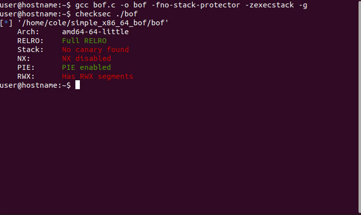

Writing the Shellcode
----
Now we are going to shift gears and look at how to write shellcode. Shellcode is a string of bytes that represent machine code and is used as a convienient way to inject code into a vulnerable program. For this exploit I am going to use shellcode that returns a command shell after being executed. Here is a quick introduction to assembly language on x86_64 architechture. 

Memory registers are used as a way to store and access memory addresses. The registers we will be using are RAX, RDI, RSI, RDX, RBX, RCX. In this order, these registers hold aruments for system calls defined in *"/usr/include/x86_64-linux-gnu/asm/unistd_64.h"*. In this file we find a function and its numeric representation. Using the **man** shell command, we can look up information about a function and what arguments need to be supplied to the syscall. The numeric representaion of a function is always put in the RAX register, and the first argument is put in the RDI register and so on, respectively to the order stated above. For this shellcode we will use the *exceve* syscall. Let's take a look at the man page for this function.

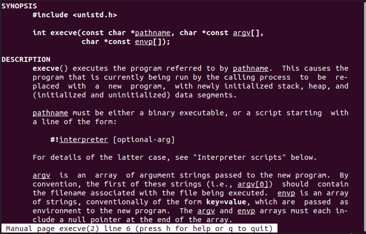

Let's define these arguments in C code for a better visual:

        *pathname[] = "/bin//sh";   //shell string, extra slash is ignored
        *argv[] = {pathname, NULL};    //argv points to our null terminated shell string
        *envp[] = NULL;               //we are not using this argument, so we set it to NULL

In a directory called *shellcode* inside the main directory are a couple of handy programs to help in writing the shellcode. This is what **shellcode.s** looks like:

        BITS 64

        ;execve(const char *filename, char *const argv[], char *const envp[])
        push 59                     ;syscall number for execve on linux_64
        pop rax                     ;syscalls are stored in rax register
        xor rdx, rdx                ;zero out rdx, makes 3rd argument NULL(envp)
        xor rbx, rbx                ;zero out rbx register
        push rdx                    ;push NULL stack
        pop rsi                     ;puts NULL into 2rd argument to execve(argv)
        mov rbx, 0x68732f2f6e69622f ;put '/bin//sh' into rbx register
        push rdx                    ;push NULL string termiator to stack
        push rbx                    ;push filename string to stack
        push rsp                    ;pointer to filename argument
        pop rdi                     ;puts filename pointer into first argument register
        syscall 

Because the stack is *FILO* (first in last out), we push our arguments to the stack backwards. First we put the syscall number for execve in RAX, using a push pop sequence to eliminate extra zeroes in that register. The RDX register is set to 0 to be uses as a null terminator, and RBX is zeroed out to be used to store data later. Then we push NULL to the stack and pop into rsi for our envp argument. Next we will move our pathname string into our data register (RBX). The string is converted to a hexadecimal representation of bytes, which needs to be backwards due to the machines little endian architecture. I wrote a quick python cli script to help make things easier. 

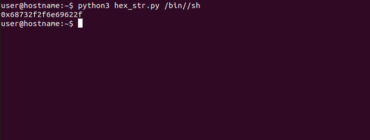

Now we have our correctly formated pathname in RBX, we push rdx to the stack to null terminate our pathname string, which is pushed to the stack next, representing our argument argv={"/bin//sh", NULL}. Then RSP (stack pointer register) is pushed to the stack, which points to our null terminated pathname string that is popped into the first argument register RDI. Finally we make the syscall, calling our function still sitting in RAX. All there is to do now is compile our shellcode with nasm, and transform the machine code into a string of bytes using *hexdump* to store in a file **shellcode.bin**. 

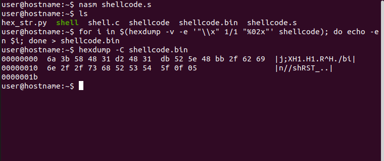

When a program is executed, the environment variables of the shell running the program are loaded into memory with the program variables. By putting our shellcode into an environment variable, all we have to do if get the location of it in memory. A couple of things are needed to make this work smoothly. First off, we have to disable ASLR. ASLR randomizes the program's memory addresses upon different executions. Also, we will use a little script I borrowed from a book called "Hacking: The Art of Exploitation" by Jon Erickson, to get the correct memory address of our environment variable. Without ASLR being disabled, the address returned by this program would not be the same upon executing our vulnerable program. Here is how to disable ASLR:

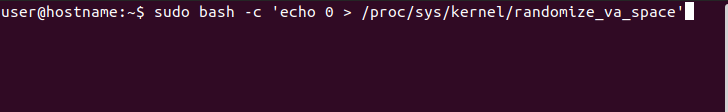

Here is the envaddr.c script for gettting the environment variable address:

        #include <stdio.h> 
        #include <stdlib.h>
        #include <string.h>

        void main(int argc, char **argv) {
            char *ptr;
            if(argc < 3) {
                printf("Usage:\t<%s><env var><target prog>\n", argv[0]);
                exit(0);
            }
            ptr = getenv(argv[1]);
            ptr += (strlen(argv[0]) - strlen(argv[2]))*2;
            printf("%s address is %p\n", argv[1], ptr); 
        }

We will set our shellcode as an environment variable and use the envaddr program to get the memory address and compile **envaddr.c** with gcc:

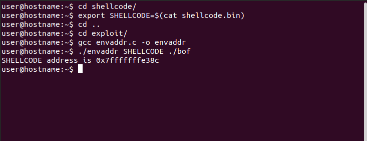

Now we are going to switch our focus back to our vulnerable program. Our shellcode is all prepared and ready to be injected, but we still need to figure out where we can place it in a way that tricks the program into executing it. Let's open **bof** in GDB and start investigating.

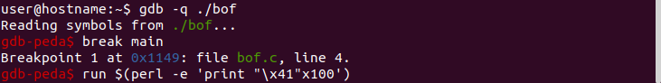

Set a breakpoint at the main function, and pass a long argument to the program. If we didn't know how large the buffer was, we could take a guess and see if the program returns a segmentation fault. So let's pass a string of 100 A's (hexadecimal \x41) and disassemble are main function. I am using perl to print and pass arguments, it makes things easier and prints our input in a way our program binary can better understand. 

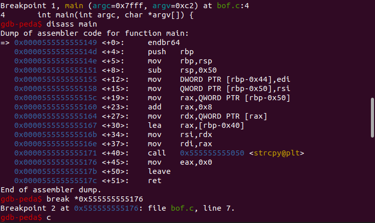

After dissasembling the main function we can see a call to strcpy. This is where are argument is put into the buffer variable. As we will need to examine the stack, and more specifically where the argument is placed on the stack, let's set a breakpoint right after the argument is copied to the buffer and continue with the programs execution with the 'c' command. This will take us to our next breakpoint and pause execution allowing us to analyze the current stack frame.

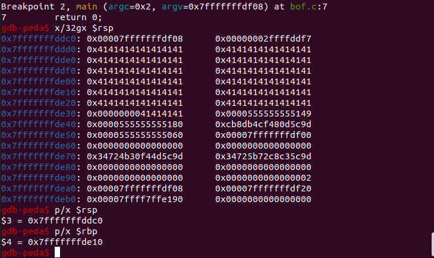

GDB allows use to reference registers with the '$' symbol preceeding the register name. Here we are most interested in the RBP register, which holds the base return address that will direct flow back to the main function after strcpy finishes, and the RSP register, which points to the current stack frame. Addresses in this architecture are 8 bytes (64 bits) and we need to break up the stack into 8 byte hexadeimal words for accurate address alignment. The 'g' symbol in "x/32gx" represents a giant word, which is 8 bytes and the "x" after represents hexadecimal format (the first x, "x/", is gdb's symbol for examine). While I am on the topic of symbols, I will also mention that the 'p' in "p/x" means "print" and the '/x' is the format specifier. looking at the stack we see a bunch of '41's. That is our argument on the stack. Assuming we didn't already know the buffer was 64 bytes long, we could get this length by subtracting the stack pointer + 16 (where the argument starts) from the return address (RBP):

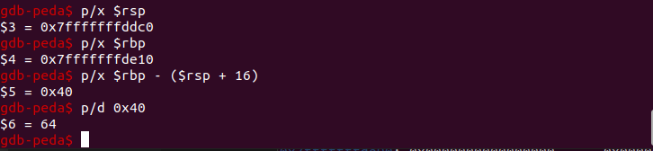

This not only shows where the buffer ends, but where the return address is located, which will be 8 bytes after the end of the buffer. We can see that we overflowed the buffer into the return address and then some. Now that we know the buffer is 64 bytes and the return address is as 8 bytes after that, we can tweak our argument to exploit this buffer overflow. There are a couple ways we can write our argument. One way is to simply overflow the buffer+8 with and NOP sled. NOP stands for no operation. The RIP (instruction pointer) will read this instruction and move to the next. An NOP sled is a string of many NOP instructions, represented by "\x90" in hexadecimal, that the the RIP will continue to step through until it reaches it's final destination, where we will conveniently place our shellcode address. But in this specific example, an NOP sled is not necessary. NOP sleds are used to make sure that shellcode placed on the stack has a better chance of being found be the RIP. But we are using an environment variable address that is perfectly aligned on the stack following the correct amount of bytes overflowing the buffer, so a string of A's will work the same. We want to place our shellcode address 8 bytes after the buffer, so we will pass an argument of 72 bytes followed by our shellcode address written in little endian format. I am going to use 64 A's to fill the buffer, and place an eight byte nop sled right before the shellcode address. Here is how this looks in gdb:

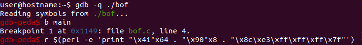

Continue to our previously set breakpoint and examine the stack:

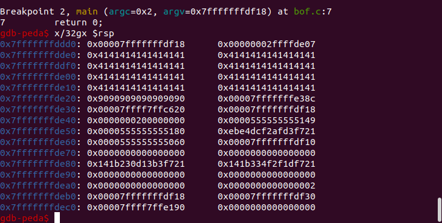

If you continue in gdb it will give you a segmentation fault signal "SIGSEGV". Quit out of gdb and run the bof program with the same argument.

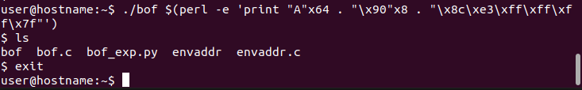

That's it! We successfully got a shell from exploiting this program. We can pass use our exploit via python script and pass an output file as and argument as well.

        #!/usr/bin/python2.7

        buff = "\x41"*64
        nop = "\x90"*8
        addr = "\x8c\xe3\xff\xff\xff\x7f"

        payload = buff + nop + addr
        print(payload)

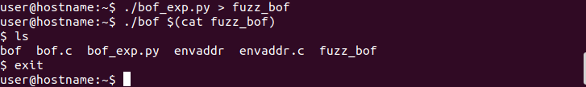

Conclusion
----
As simple as this exploit looks, there is a lot more going on behind the seens. If you step through this program with gdb and disassemble the PLT and GOT functions, you can trace procedures and find the shellcode we wrote and put in an environment variable. Ultimately it becomes clear that this exploit completely relies on the optimization flags passed to the compiler, and is not all that effective against modern x86_64 architecture security measures. Nevertheless, alot of useful information can be learned from outdated exploits like this, especially when it comes to the debugging and reverse engineering aspects. To be able to exploit this program with modern securities enabled, there are many things that need to be dealt with, such as the stack canary, Address Space Layout Randomization (ASLR), Position Independent Executables (PIE), Relocation Readonly (RELRO), and No eXecute bit (NX, which we disabled using '-zexecstack'). Ultimately my goal is to better understand these securities and apply what I know as an ethical hacker to help better protect people against malicious attcks. Comments and constructive criticism are much appreciated as I am continuing to learn. 